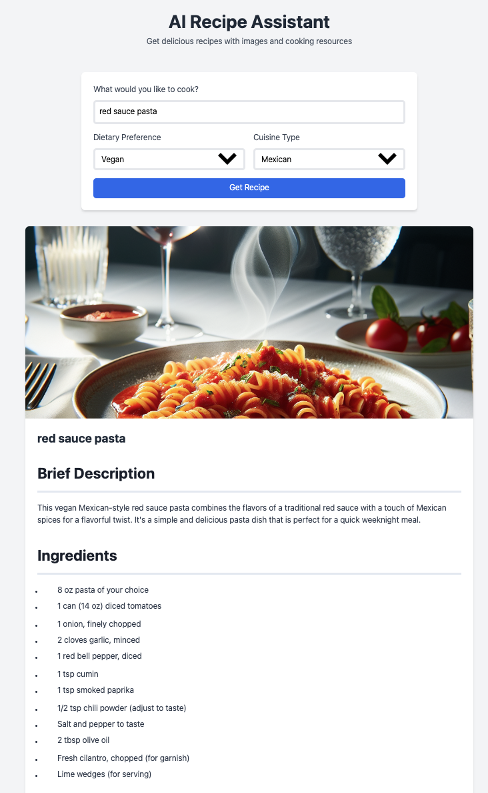

# AI Food Recipe Assistant 🍳

A modern, AI-powered recipe generation web application that creates personalized recipes with images and learning resources. Built with FastAPI, OpenAI GPT, and a responsive web interface.



# [Detailed Step-by-Step Guide available here](https://lnkd.in/eGuM8d6w)

## 🌟 Features

- **AI-Powered Recipe Generation**: Utilizes OpenAI GPT-3.5 to create detailed, personalized recipes
- **Dynamic Image Generation**: Creates appetizing food images using DALL-E 3
- **Dietary Preferences**: Supports various dietary requirements (vegetarian, vegan, gluten-free, keto)
- **Cuisine Types**: Multiple cuisine options (Italian, Mexican, Indian, Chinese, Japanese)
- **Markdown Formatting**: Beautiful, well-structured recipe presentation
- **Responsive Design**: Modern UI that works on all devices
- **Real-time Generation**: Instant recipe creation with loading states
- **Error Handling**: Comprehensive error management and user feedback

## 🚀 Tech Stack

### Backend
- **Framework**: FastAPI
- **AI Integration**: OpenAI API (GPT-3.5 & DALL-E 3)
- **Language**: Python 3.11+
- **Key Libraries**:
  - `openai`: AI model integration
  - `pydantic`: Data validation
  - `python-dotenv`: Environment management
  - `uvicorn`: ASGI server

### Frontend
- **HTML5** with modern features
- **TailwindCSS** for styling
- **AlpineJS** for interactivity
- **Marked.js** for markdown rendering

## 🛠️ Setup

1. **Clone the repository**
   ```bash
   git clone https://github.com/rohitg00/ai-food-recipe-assistant.git
   cd ai-food-recipe-assistant
   ```

2. **Set up Python environment**
   ```bash
   python -m venv venv
   source venv/bin/activate  # On Windows: venv\Scripts\activate
   pip install -r requirements.txt
   ```

3. **Configure environment variables**
   ```bash
   cp .env.example .env
   # Edit .env and add your OpenAI API key:
   # OPENAI_API_KEY=your_api_key_here
   ```

4. **Run the application**
   ```bash
   uvicorn main:app --reload
   ```

5. **Access the application**
   - Open `http://localhost:8080` in your browser

## 🌊 Application Flow

1. **User Input**
   - User enters recipe query
   - Optionally selects dietary preferences and cuisine type
   - Frontend validates input before submission

2. **Recipe Generation**
   - Backend receives request and validates parameters
   - OpenAI GPT-3.5 generates recipe in markdown format:
     - Brief description
     - Ingredients list
     - Step-by-step instructions
     - Cooking tips
     - Nutritional information

3. **Image Generation**
   - DALL-E 3 creates a photorealistic image of the recipe
   - Image is optimized and cached for performance

4. **Response Processing**
   - Recipe is formatted and structured
   - Frontend renders markdown content
   - Image is displayed with loading states
   - Error handling manages API failures gracefully

## 📋 API Endpoints

### POST /recipe
Generates a new recipe with image

**Request Body**:
```json
{
  "query": "string",
  "diet_preference": "string | null",
  "cuisine_type": "string | null"
}
```

**Response**:
```json
{
  "recipe": "string (markdown)",
  "image_url": "string",
  "learning_resources": [
    {
      "type": "string",
      "title": "string",
      "url": "string"
    }
  ]
}
```

## 🔒 Security

- API keys stored securely in environment variables
- Input validation at multiple levels
- CORS middleware implemented
- No sensitive information exposed to frontend

## 🎯 Future Enhancements

1. Recipe saving and sharing functionality
2. User accounts and preferences
3. Advanced filtering options
4. Ingredient substitution suggestions
5. Integration with shopping lists
6. Mobile app version
7. Recipe rating system
8. Social sharing features

## 📝 License

[MIT License](LICENSE) - feel free to use this project for learning and development!

## 🤝 Contributing

Contributions are welcome! Please feel free to submit a Pull Request.

1. Fork the repository
2. Create your feature branch
3. Commit your changes
4. Push to the branch
5. Open a Pull Request

## 📞 Support

For support, please open an issue in the GitHub repository or contact the maintainers.

---
Made with ❤️ by [Rohit Ghumare](https://github.com/rohitg00)
